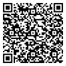

---
output:
    html_document:
      css: defense-in-style.css
---

<!-- Custom Header Start -->

  <h1 class="project-name" style="color: white;">🤫🎁 Fabio's Secret Gift 🎁🤫</h1>
  
Please do not tell Fabio about this!

<!-- Custom Header End -->

## 📖 Friendship book 📖

In addition to the main gift, we would like to gift Fabio a “friendship book” and we need your input for that!

  

**Deadline to fill out:** Monday, April 8th, 2024

**Steps:**

1. On the landing page, enter your name, email, and pick a language for the questionnaire (click [here](FABIO_DO_NOT_OPEN.jpg) to see what the landing page looks like).
    + If you do not see a language picker, try opening the link in private/incognito mode of your browser.
    + For languages, you can choose between English, German, and Italian. If you pick either German or Italian, you will see the questions in both languages. Fill the questionnaire out in the language you picked.
2. Answer several questions about Fabio.
3. Write a short personal message.
4. Upload a picture of yourself.

***Ready? To access Fabio's friendship book, please click the button below***

<a href="https://mijnvriendenboekje.nl/nw/index.php?r=participant%2Finvitation-link&bookId=64148&token=tLOQA84ZovB0YIg_Z7YUYvH1i3n7-oyE5lnkteJinDWQ" class="button" style="color: white;">Friendship Book</a>

  

***Or scan the QR code***

#### Things to keep in mind

+ Everything on your page is optional so you can also leave out questions or a picture if you prefer that.
+ If you cannot access the link, please reach out to us by clicking [here](mailto:fabio.votta.defense@gmail.com) and we will add you.
+ If you have more pictures which you would like to see in the friendship book, please send them to us by clicking [here](mailto:fabio.votta.defense@gmail.com).

  
