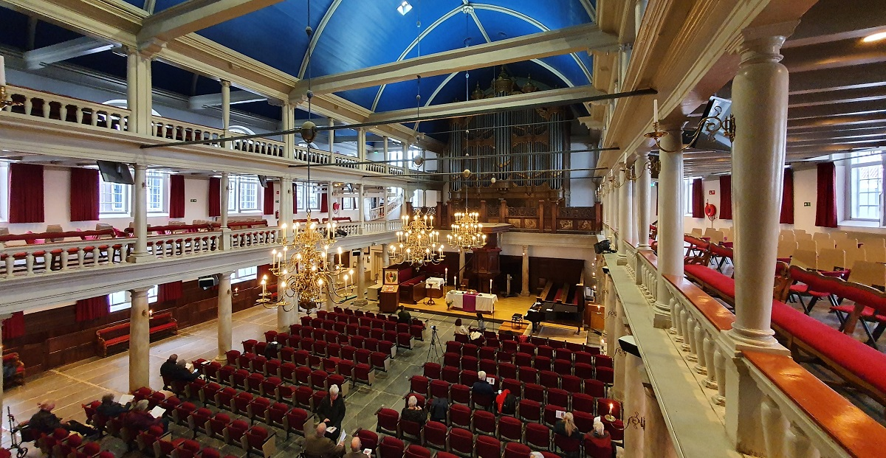
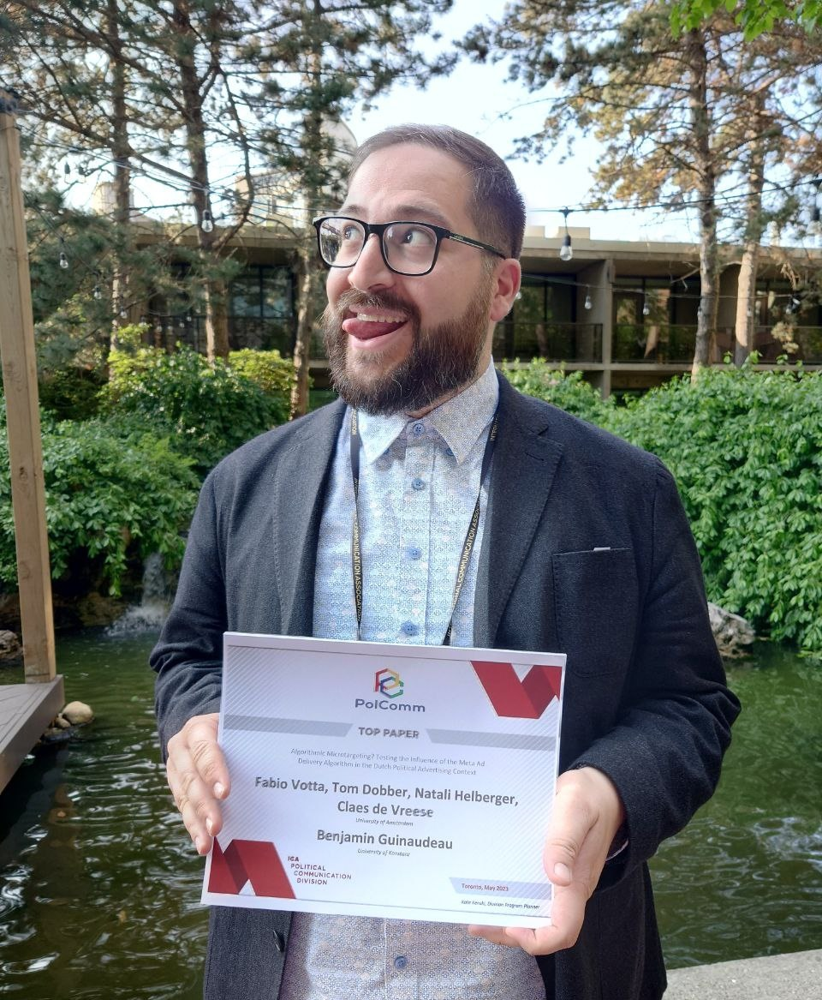
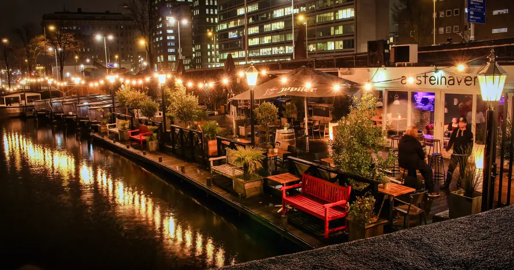

```{css, echo=FALSE}

.break .nav-tabs, .break .nav-pills {
  display: flex;
  justify-content: center;
  width: 100%;
}

.break .nav-tabs .nav-item, .break .nav-pills .nav-item {
  margin: 0 auto; /* Centers the nav items if they have a specific width */
}

.break .nav-tabs .nav-link, .break .nav-pills .nav-link {
  margin-right: 5px; /* Optional: Adds some space between the tabs */
}


.button {
  background-color: #144F7C; /* Blue background */
  border: none;
  color: white;
  padding: 10px 20px; /* Size of the padding around the text */
  text-align: center;
  text-decoration: none;
  display: inline-block;
  font-size: 16px; /* Size of the font */
  margin: 4px 2px;
  cursor: pointer;
  border-radius: 5px; /* Rounded corners */
  transition-duration: 0.4s; /* Smooth transition effect for hover state */
}

/* Darker background on mouse-over */
button:hover {
  background-color: #17616A;
}


a {
  color: #1e6bb8;
  text-decoration: none;
}
a:hover {
  text-decoration: underline;
}


.break .nav-tabs, .break .nav-pills {
  display: flex;
  justify-content: center;
  width: 100%;
}

.break .nav-tabs .nav-item, .break .nav-pills .nav-item {
  margin: 10 auto; /* Centers the nav items if they have a specific width */
}

.break .nav-tabs .nav-link, .break .nav-pills .nav-link {
  margin-right: 5px; /* Optional: Adds some space between the tabs */
  font-size: 16px; /* Size of the font */
}

blockquote {
  border-left: none; /* Removes the left border or bar */
  color: #159957; /* Sets the text color to black */
  margin-left: 0; /* Adjusts the left margin if necessary */
  padding-left: 0; /* Removes padding on the left if it exists */
}

.title {
    display: none;
}
```

<!-- <style> -->
<!-- img { -->
<!--   height: 356px; -->
<!--   width: 356px; -->
<!--   border-radius: 0.3rem; -->
<!--   object-fit: cover; -->
<!-- } -->
<!-- </style> -->

<!-- Custom Header Start -->
<div class="header">
  <h2 class="project-name">Fabio's Doctoral Defense Ceremony</h2>
  <h3 class="project-tagline">Find all the information below for Fabio's big day! ✨🚤👨🏻‍🎓✨</h3>
</div>
<!-- Custom Header End -->

<center>


You are cordially invited to attend when Fabio will defend his PhD dissertation, entitled:

<p class="fancy">A Dance with Data</p>
<p class="fancy2">Unraveling the Supply and Demand Side of Political Microtargeting</p>


<center><h4>Please let us know if you plan to attend by clicking the button below</h4></center>

<center><a href="https://forms.gle/f4YLD5jomEYPTgKy7" class="button" style="color: white;">RSVP</a></center>

<h4 class="fancy3">📅 Friday, April 19, 2024</h2>


</center>

<hr>

<h4>Join us and celebrate as our dear Fabio becomes...</h4>


```{r, echo = TRUE}
title <- "Dr."
name <- "Fabio Votta"
print(glue::glue("{title} {name}"))
```

<hr>

<!-- ***️❗️ Make sure to scroll all the way to the end for the secret page! (unless you're Fabio, in which case, nothing to see here...️)*** -->

## > Event Information {.tabset .tabset-fade .tabset-pills .break #event_info}


<center>

**📅 Date:** Friday, April 19, 2024

*Click [here](https://calendar.google.com/calendar/u/4?cid=ZmFiaW8udm90dGEuZGVmZW5zZUBnbWFpbC5jb20) to download full day calendar invite and location information.*


### 14:00 Defense Ceremony 🧑🏻‍🏫 {#dissertation_info}

**🕐 Time:**
14:00 (2:00PM) - 15:30 (3:30PM)

> *Please arrive 30 minutes before starting time at **13:30** as entry is not allow once the ceremony starts.*


**>📍 Location:** [Aula UvA, Singel 411, 1012 WN Amsterdam](https://www.google.com/maps/place//data=!4m2!3m1!1s0x47c609c193a4380f:0xccfdbd1232ff182d?sa=X&ved=2ahUKEwjXqt7Xy7WEAxUd_7sIHeA-A-4Q4kB6BAgPEAA)

.JPG)

**📝 Program:**

| Time     | Agenda |
| -------- | ------- |
| 13:30  | Arrival and entry    |
| 14:00 | Start of Presentation (Layman's Talk)     |
| 14:10    | End of Presentation    |

*5 MINUTES BREAK*

| Time     | Agenda |
| -------- | ------- |
| 14:15  | Committee Entrance + Q&A session   |
| 15:00 | Committee Decision    |
| 15:30    | End of Defense Ceremony   |

**🎥 Livestream Link:**

Click [here](https://www.uva.nl/en/research/phd/phd-defence-ceremony-agenda/phd-defence-ceremonies.html?t=fmg) to access the livestream.


<details>
  <summary>**> 🚗🚇🚋 How To Get There**
</summary>


Public Transport


🚇 Metro Station **Rokin** via *Metro 52 (Blue Line)*

🚋 Tram Station **Rokin** via *Tram 4*, *Tram 14*, and *Tram 24*

🚋 Tram Station **Koningsplein** via *Tram 2* and *Tram 12*


Car Parking Options:

*Note that finding a parking spot may be difficult*

🅿️ Stopera/Waterlooplein (Valkenburgerstraat 238)

🅿️ Q-Park de Bijenkorf (Beursstraat 15)


</details> 




<!-- <br> -->
<!-- </br> -->

### 15:30 Reception 🍻 {#borrel}
**🕐 Time:**
15:30 (3:30PM) - 17:00 (5:00PM)
  
> *The reception (snacks & drinks) begins directly after the defense ceremony and is at the same location.*


**>📍 Location:** [Aula UvA, Singel 411, 1012 WN Amsterdam](https://www.google.com/maps/place//data=!4m2!3m1!1s0x47c609c193a4380f:0xccfdbd1232ff182d?sa=X&ved=2ahUKEwjXqt7Xy7WEAxUd_7sIHeA-A-4Q4kB6BAgPEAA)


<details>
  <summary>**> 🚗🚇🚋 How To Get There**
</summary>


Public Transport


🚇 Metro Station **Rokin** via *Metro 52 (Blue Line)*

🚋 Tram Station **Rokin** via *Tram 4*, *Tram 14*, and *Tram 24*

🚋 Tram Station **Koningsplein** via *Tram 2* and *Tram 12*


Car Parking Options:

*Note that finding a parking spot may be difficult*

🅿️ Stopera/Waterlooplein (Valkenburgerstraat 238)

🅿️ Q-Park de Bijenkorf (Beursstraat 15)


</details> 


### 19:30 Party 🎉 {#after_party}
**🕐 Time:**
19:30 (7:30PM) - *open end*

<p class="fancy">dr::Fabio Votta</p>

> *Let's celebrate Fabio's ascension to doctordom!*



**>📍 Location:** Amstelhaven [Op Professor Tulpplein / naast Amstelhotel, Mauritskade 1, 1091 EW Amsterdam](https://www.google.com/maps/place//data=!4m2!3m1!1s0x47c6099a0deb8719:0x54e805a776cfbeed?sa=X&ved=2ahUKEwiH2NDt57WEAxXog_0HHRkKCa0Q4kB6BAg5EAA)

<br>

<details>
  <summary>**> 🚗🚇🚋 How To Get There**
</summary>


Public Transport


🚇 Metro Station **Wesperplein** via *Metro 51* (Orange Line), *Metro 53* (Red Line), and *Metro 54* (Yellow Line)

🚋 Tram Station **Weesperplein** via *Tram 1*, *Tram 7*, and *Tram 19*


</details> 



# {-}

<hr>

<center>
> *Please click the button below for information on Fabio's gift (if you're not Fabio)*

<center><a href="FABIO_DO_NOT_OPEN.html" class="button" style="color: white;">🎁 Fabio's Gift 🎁</a></center>
</br>

</center>


<hr>


## Event Media

<center>

**Instagram:** @fabiodefense

**Hashtag:** #DrFabio

<hr>

</center>


</center>

<!-- <h2>Overview</h2> -->

<!-- + [Event Information](#event_info) -->

<!-- + Download ALL event calendar invites -->

<!-- -   Event info (time, location, duration, dress code, similar to emails from other defense) -->

<!-- -   RSVPs link to google form where we collect emails (optional) and allow down of calendar invite - HERE add both dissertation, borrel, and party -->

<!-- -   Calendar invite with both dissertation + borrel and party invites - kinda like phd club -->

<!-- -   Link to maps dissertation + borrel and party location -->

<!-- -   (Optional) Summary of dissertation, maybe abstract with the hopefully cute and badass cover -->

<!-- -   Secret gift page with donation payment options - use IBAN, tikkie, my paypal or ask if sophia can set it up -->

<!-- -   Insta page + Hashtag -->

<!-- -    -->
